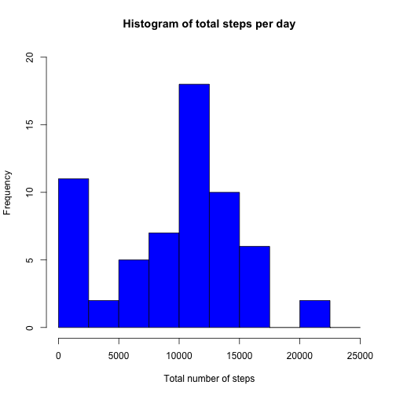
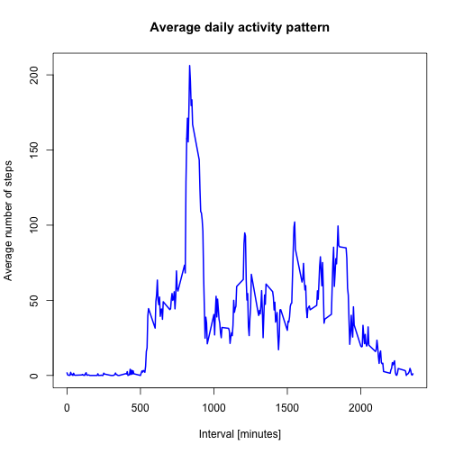
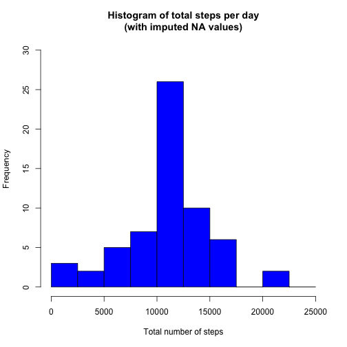
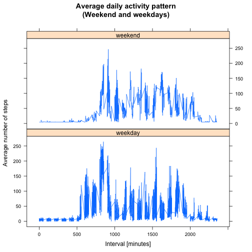

# Reproducible Research: Peer Assessment 1

Valentina Scipione

May 17, 2015

## Introduction

It is now possible to collect a large amount of data about personal movement using activity monitoring devices such as a Fitbit, Nike Fuelband, or Jawbone Up. These type of devices are part of the “quantified self” movement – a group of enthusiasts who take measurements about themselves regularly to improve their health, to find patterns in their behavior, or because they are tech geeks. But these data remain under-utilized both because the raw data are hard to obtain and there is a lack of statistical methods and software for processing and interpreting the data.

This report makes use of data from a personal activity monitoring device. This device collects data at 5 minute intervals through out the day. The data consists of two months of data from an anonymous individual collected during the months of October and November, 2012 and include the number of steps taken in 5 minute intervals each day.

With this report we want to answer the following questions:

- What is mean total number of steps taken per day?
- What is the average daily activity pattern?
- Are there differences in activity patterns between weekdays and weekends?

## Data

The dataset used in this report can be downloaded at this [link](https://d396qusza40orc.cloudfront.net/repdata%2Fdata%2Factivity.zip).

The variables included in this dataset are:

- **steps**: Number of steps taking in a 5-minute interval (missing values are coded as NA)

- **date**: The date on which the measurement was taken in YYYY-MM-DD format

- **interval**: Identifier for the 5-minute interval in which measurement was taken

The dataset is stored in a comma-separated-value (CSV) file and there are a total of 17,568 observations in this dataset.

## Loading and preprocessing the data

First we unzip the file and load the data into R.


```r
activity <- read.csv("activity.csv", header = T, sep = ",", stringsAsFactors = F)
```

We want to check if the data is in a suitable format for our analysis by looking at the first 6 rows of the dataset.


```r
head(activity)
```

```
##   steps       date interval
## 1    NA 2012-10-01        0
## 2    NA 2012-10-01        5
## 3    NA 2012-10-01       10
## 4    NA 2012-10-01       15
## 5    NA 2012-10-01       20
## 6    NA 2012-10-01       25
```

The previous output shows that during the first day of data collection we have several intervals with missing values that we will need to deal later with.


## 1) What is mean total number of steps taken per day?

We want to know the mean total number of steps taken per day. For this part of the analysis we ignore the missing values in the dataset.
We begin with plotting a histogram of the total number of steps taken each day.


```r
# Aggregate observations by date and sum steps taken per each day (NA values removed)
sum_steps <- aggregate(activity$steps, by=list(activity$date), FUN=sum, na.rm=TRUE)

# Rename attributes
names(sum_steps) <- c("date", "total")

# Create histogram of the total number of steps each day
hist(sum_steps$total, 
     breaks=seq(from=0, to=25000, by=2500),
     col="blue", 
     xlab="Total number of steps", 
     ylim=c(0, 20), 
     main="Histogram of total steps per day")
```

 

We compute now the mean and the median of the total number of steps taken per day.


```r
total_mean <- mean(sum_steps$total)
total_median <- median(sum_steps$total)
```

The **mean** and the **median** of the total number of steps taken per day are **9354** and **10395**, respectively.  


## 2) What is the average daily activity pattern?

We investigate the average daily activity pattern by plotting the average number of steps taken for subsequent day 5-minute intervals, averaged across all days.


```r
# Aggregate observations by interval and compute the means of steps across all days
mean_steps <- aggregate(activity$steps, 
                       by=list(activity$interval), 
                       FUN=mean, 
                       na.rm=TRUE)

# Rename the attributes
names(mean_steps) <- c("interval", "mean")

# Create time series plot of the 5-minute interval and the average number of steps taken across all days
plot(mean_steps$interval, 
     mean_steps$mean, 
     type="l", 
     col="blue", 
     lwd=2, 
     xlab="Interval [minutes]", 
     ylab="Average number of steps", 
     main="Average daily activity pattern")
```

 


We want to find out which 5-minute interval, on average across all the days in the dataset, contains the maximum number of steps.
We find the position of the maximum mean and lookup the value of the interval at this position.


```r
max_mean_steps <- which(mean_steps$mean == max(mean_steps$mean))
max_interval <- mean_steps[max_mean_steps, 1]
```

The result of this computation tells us that the 5-minute interval that contains the maximum of steps is **835**.


## Imputing missing values

As mentioned at the beginning of this report, there are a number of days/intervals where there are missing values. The presence of missing days may introduce bias into some calculations or summaries of the data.
In this section we will deal with those missing values (so called NA values).

We begin with calculating the total number of missing values in the dataset.

```r
NA_count <- sum(is.na(activity$steps))
```

This gives us the total number of NAs of **2304**.

We need to use a strategy for filling in all of the missing values in the dataset: we replace each NA value with the mean number of steps for corresponding interval.
We create a new dataset that is equal to the original dataset but with the missing data filled in, making use of the strategy descripted above.


```r
# Find the NA indexes
na_index <- which(is.na(activity$steps))

# Create new dataset
newActivity <- activity
newActivity[na_index, "steps"] <- rep(mean(activity$steps, na.rm=TRUE), times=length(na_index))
```

We want to check if our strategy was correctly applied by looking at the first 6 rows of the new dataset.


```r
head(newActivity)
```

```
##     steps       date interval
## 1 37.3826 2012-10-01        0
## 2 37.3826 2012-10-01        5
## 3 37.3826 2012-10-01       10
## 4 37.3826 2012-10-01       15
## 5 37.3826 2012-10-01       20
## 6 37.3826 2012-10-01       25
```

We plot again the histogram of the total number of steps taken each day, this time with the imputed NA values.


```r
# Aggregate observations by date and sum steps taken per each day (NA values imputed)
sum_steps_new <- aggregate(newActivity$steps, by=list(newActivity$date), FUN=sum)

# Rename attributes
names(sum_steps_new) <- c("date", "total")

# Create histogram of the total number of steps each day
hist(sum_steps_new$total, 
     breaks=seq(from=0, to=25000, by=2500),
     col="blue", 
     xlab="Total number of steps", 
     ylim=c(0, 30), 
     main="Histogram of total steps per day\n(with imputed NA values)")
```

 

We compute now the mean and the median of the total number of steps taken per day for the new dataset.


```r
total_mean_new <- mean(sum_steps_new$total)
total_median_new <- median(sum_steps_new$total)
```

The **mean** and the **median** of the total number of steps taken per day are now **10766** and **10766**, respectively, with the imputed NA values.  

We can observe that imputing NA values has an inpact on the values of total number of steps taken per day. In particular:

- the mean and the median have exactly the same value when using imputed NA values;
- both mean and median are higher than the corresponding values computed from the raw dataset.


## Are there differences in activity patterns between weekdays and weekends?

Last question we want to solve is whether or not there are differences in activity patterns between weekdays and weekends. 
We investigate it by creating a new factor variable in our dataset (the one with imputed NA values) with two levels -- "weekday" and "weekend" -- indicating whether a given date is a weekday or weekend day, respectively.


```r
# Transform the date attribute to an actual date format
newActivity$date <- as.POSIXct(newActivity$date, format="%Y-%m-%d")

# Compute the weekdays from the date attribute
newActivity <- data.frame(date=newActivity$date, 
                           weekday=tolower(weekdays(newActivity$date)), 
                           steps=newActivity$steps, 
                           interval=newActivity$interval)

# Compute the day type (weekend or weekday)
newActivity <- cbind(newActivity, 
                      daytype=ifelse(newActivity$weekday == "saturday" | 
                                     newActivity$weekday == "sunday", "weekend", 
                                     "weekday"))

# Create the final data.frame
newActivity <- data.frame(date=newActivity$date, 
                       weekday=newActivity$weekday, 
                       daytype=newActivity$daytype, 
                       interval=newActivity$interval,
                       steps=newActivity$steps)
```

The new factor variable is displayed below:


```r
head(newActivity)
```

```
##         date weekday daytype interval steps
## 1 2012-10-01  monday weekday        0    37
## 2 2012-10-01  monday weekday        5    37
## 3 2012-10-01  monday weekday       10    37
## 4 2012-10-01  monday weekday       15    37
## 5 2012-10-01  monday weekday       20    37
## 6 2012-10-01  monday weekday       25    37
```

Finally, we investigate the daily activity pattern averaged across all weekday days or weekend days by plotting a time series of the 5-minute interval and the average number of steps taken, averaged across all weekday days or weekend days.


```r
# Compute the average number of steps taken, averaged across all daytype variable
library(lattice)
mean_steps_new <- aggregate(newActivity$steps, 
                       by=list(newActivity$daytype, 
                               newActivity$weekday, newActivity$interval), mean)

# Rename the attributes
names(mean_steps_new) <- c("daytype", "weekday", "interval", "mean")

xyplot(mean ~ interval | daytype, mean_steps_new, 
       type="l", 
       lwd=1, 
       xlab="Interval [minutes]", 
       ylab="Average number of steps", 
       main="Average daily activity pattern\n(Weekend and weekdays)",
       layout=c(1,2))
```

 

As expected, the activity pattern between weekdays and weekends is different. During the weekdays, activity shows a peak in the morning but remains below ~100 steps for the rest of the day, whereas the weekend activity pattern is overall evenly distributed throughout the day and remains higher than the weekday activity for most part of the day.
